# Contract Relations

## Architecture

Arrows point from the caller/source to the target contract or dependency. Dashed arrows indicate read-only checks, off-chain access, or ZK/FHE proof dependencies.

```mermaid
%%{init: {'flowchart': {'curve': 'linear', 'htmlLabels': false, 'nodeSpacing': 48, 'rankSpacing': 72}}}%%
flowchart LR
    subgraph Accounts["External actors / accounts"]
        direction TB
        BOARD([Board / Safe])
        INVESTOR([Investor])
        OPERATOR([Platform Operator])
    end

    subgraph Platform["Platform contracts (one per chain)"]
        direction TB
        CF[CompanyFactory]
        RR[RuleRegistry]
        PR[ProviderRegistry]
        AP[AttestationProvider]

        subgraph Verifiers["ZK verifiers"]
            direction TB
            CONV[ConversionVerifier]
            REPAY[CnRepayVerifier]
            SHV[SharedHonkVerifier]
        end
    end

    subgraph PerCompany["Per-company contracts"]
        direction TB

        subgraph Governance["Governance and treasury"]
            direction LR
            C[Company]
            V[Vault]
            DR[DataRoom]
        end

        subgraph ShareClass["Share class stack"]
            direction LR
            ST[D01ShareToken]
            SE[SnapshotEngine]
            REng[RuleEngine]
            SR[ShareholderRegistry]
        end

        subgraph Instruments["Equity and fundraising"]
            direction LR
            VS[VestingSchedule]
            OP[OptionPool]
            FR[Fundraise]
            S[SAFE]
            CN[ConvertibleNote]
        end
    end

    subgraph Rules["Compliance Rules (per share class clones)"]
        direction TB
        RKYC[RuleKYC]
        RAC[RuleAccredited]
        ROFAC[RuleOFAC]
        RCB[RuleCountryBlocklist]
        RREGS[RuleRegS]
        RHP[RuleHoldingPeriod]
    end

    subgraph Legend["Legend"]
        direction TB
        LG1[Platform contract]
        LG2[Governance / treasury]
        LG3[Share class / equity ops]
        LG4[Fundraise / convertibles]
        LG5[Compliance rule]
        LG6[Data room]
        LG7([External account])
        LG8[ZK verifier]
    end

    %% External callers
    BOARD -->|governs| C
    BOARD -->|manages rounds| FR
    BOARD -->|grants options| OP
    BOARD -->|manages rooms| DR
    INVESTOR -->|invests payment token| FR
    OPERATOR -.->|FHE access + off-chain proofs| FR
    OPERATOR -.->|folder-key access| DR
    OPERATOR -.->|SAFE proof inputs| S
    OPERATOR -.->|note proof inputs| CN

    %% Deployment and share-class setup
    CF -->|deployCompany clones suite| C
    C -->|calls deployShareClass| CF
    CF -->|deployShareClass deploys token stack| ST
    C -->|registers share class| SR
    C -.->|checks approved impls| RR
    RR -.->|approves rule impls| Rules

    %% Attestations
    RKYC -.->|reads| AP
    RAC -.->|reads| AP
    AP -.->|registered in| PR

    %% Core flows
    C -->|controls| V
    C -->|mints shares| ST
    C -->|creates schedules| VS
    VS -->|burns unvested| ST
    OP -->|exercise issuance via| C
    S -->|conversion issuance via| C
    CN -->|conversion issuance via| C
    FR -->|priced-round issuance via| C
    FR -->|SAFE issue + conversion request| S
    FR -->|note issue + conversion request| CN
    FR -->|settles payment token| V
    ST -->|snapshot hooks| SE
    ST -->|transfer checks| REng
    ST -->|updates registered| SR
    REng -.->|runs| RKYC
    REng -.->|runs| RAC
    REng -.->|runs| ROFAC
    REng -.->|runs| RCB
    REng -.->|runs| RREGS
    REng -.->|runs| RHP
    DR -.->|checks board via| C

    %% ZK conversion
    S -.->|verify proof| SBV
    CN -.->|verify proof| CBV
    SBV -->|shared verifier| SHV
    CBV -->|shared verifier| SHV

    %% Node colors
    classDef account fill:#334155,stroke:#0f172a,color:#fff,stroke-width:1.5px
    classDef platform fill:#4f46e5,stroke:#3730a3,color:#fff,stroke-width:1.5px
    classDef governance fill:#0284c7,stroke:#0369a1,color:#fff,stroke-width:1.5px
    classDef shareClass fill:#059669,stroke:#047857,color:#fff,stroke-width:1.5px
    classDef fundraising fill:#d97706,stroke:#b45309,color:#fff,stroke-width:1.5px
    classDef compliance fill:#dc2626,stroke:#b91c1c,color:#fff,stroke-width:1.5px
    classDef dataRoom fill:#9333ea,stroke:#7e22ce,color:#fff,stroke-width:1.5px
    classDef verifier fill:#7c3aed,stroke:#5b21b6,color:#fff,stroke-width:1.5px

    class BOARD,INVESTOR,OPERATOR,LG7 account
    class CF,RR,PR,AP,LG1 platform
    class C,V,LG2 governance
    class ST,SE,SR,VS,OP,LG3 shareClass
    class FR,S,CN,LG4 fundraising
    class REng,RKYC,RAC,ROFAC,RCB,RREGS,RHP,LG5 compliance
    class DR,LG6 dataRoom
    class SHV,SBV,CBV,LG8 verifier

    %% Group backgrounds
    style Accounts fill:#f8fafc,stroke:#94a3b8,color:#0f172a
    style Platform fill:#eef2ff,stroke:#a5b4fc,color:#0f172a
    style Verifiers fill:#f5f3ff,stroke:#c4b5fd,color:#0f172a
    style PerCompany fill:#ecfeff,stroke:#67e8f9,color:#0f172a
    style Governance fill:#e0f2fe,stroke:#7dd3fc,color:#0f172a
    style ShareClass fill:#ecfdf5,stroke:#86efac,color:#0f172a
    style Instruments fill:#fff7ed,stroke:#fdba74,color:#0f172a
    style Rules fill:#fef2f2,stroke:#fca5a5,color:#0f172a
    style Legend fill:#ffffff,stroke:#cbd5e1,color:#0f172a
```



## Core Interactions

### Share Issuance
```
Board → EquityIssuance.issueGrant(className, to, amount, purpose, ref)
  → _mint:
    → NoOp guards (system addresses)
    → _checkOptionPoolCapacity(token, amount)
    → _checkInvestorCompliance(token, to) via RuleEngine.detectTransferRestriction
    → ShareToken.issueShares(to, amount)  (onlyIssuance + MINTER_ROLE)
      → mint() → _update: authorizedShares cap enforced
      → ShareholderRegistry.updateOnTransfer()

Vested grants:
Board → EquityIssuance.issueGrantWithVesting(token, beneficiary, amount, ...)
  → _mint(token, vestingScheduleAddr, amount, "Vesting schedule", ref)
    (compliance skipped for vesting recipient; the CMTAT release-time transfer
     re-checks the beneficiary against the rule engine)
  → VestingSchedule.createSchedule(beneficiary, ...)
```

### Share Transfer
```
Shareholder → D01ShareToken.transfer()
  → RuleEngine.detectTransferRestriction()
  → If allowed, transfer executes
  → ShareholderRegistry.updateOnTransfer()
```

### Dividend Distribution
```
Board → Company.declareDividend(amount, recordDate, paymentDate)
  → recordDate capped at 1 year ahead
  → SnapshotEngine.scheduleSnapshot(recordDate)
  → Vault reserves dividend amount
Board → Company.distributeDividends(dividendId)
  → For each shareholder (append-only registry, deduped via transient storage):
    → Query balance at recordDate via SnapshotEngine
    → Calculate pro-rata share
    → Per-payout: release reservation → Vault.withdrawToken → re-reserve on failure
```

### Fundraise Investment
```
Board → Fundraise.createRound(type, terms...)
Board → Fundraise.addToWhitelist(roundId, investors[])
Board → Fundraise.reserveSpot(investor, amount, useCustomTerms?, encryptedTerms?)  (optional)

Investor → Fundraise.invest(roundId, amount, termsCommitment, encryptedSalt)
  → Whitelist / reservation checked
  → Min/max + hardCap validated
  → ERC-20 payment token (e.g. MUSD) transferred to Fundraise
  → One Investment row pushed per invest (no consolidation)
  → FHE viewing rights granted to investor / board / operator
```

### SAFE / Note Conversion (Async ZK-Gated)
```
Board → Fundraise.finalizeRound(safeRoundId | noteRoundId)
  → Iterate Investment rows → one SAFE/Note issued per row
    → SAFE.issueSAFEFromFundraise() / ConvertibleNote.issueNoteFromFundraise()

Board → Fundraise.finalizeRound(pricedRoundId)
  → If totalRaised >= qualifiedFinancingThreshold AND active instruments exist:
    → company.issuance().triggerConversion(price, fullyDiluted, expiresAt, doc)
      (onlyFundraise; opens one joint batch on EquityIssuance)
    → SAFE._markPendingConversion(...) / ConvertibleNote._markPendingConversion(...)
    → Both transition matching active instruments to PendingConversion
  → company.issuance().issueFromPricedRound(roundId, doc) for priced investors
    → loops Fundraise.getInvestments(roundId) → _mint per non-refunded investor

Manual board path (no qualifying round needed):
Board → Fundraise.triggerConversions(price, fullyDiluted, expiresAt, doc)  (onlyBoard)
  → delegates to EquityIssuance.triggerConversion(...) (same gate stays tight)

Off-chain (platform operator):
  → Decrypt FHE'd terms (operator key)
  → Run YC post-money math (mirrors `circuits/lib/conversion_math`)
  → Generate Poseidon2 shares commitments
  → Produce UltraHonk proof via bb.js (Keccak FS, EVM flavor)

Anyone → EquityIssuance.applyConversion(batchId, safeResults[], noteResults[], proof, encryptedMemo)
  → ConversionVerifier.verify(proof, publicInputs)
  → If valid:
    → Phase 1: SAFE._applyConversion / ConvertibleNote._applyConversion flip state
    → Phase 2: EquityIssuance loops results and calls _mint per recipient
              (compliance re-checked per investor)

Liveness escape hatch:
  → After expiresAt (default +14 days) anyone can call
    EquityIssuance.rollbackConversion(batchId)
  → All instruments return to Active for retry on next qualifying round

Stuck-conversion recovery (no wait):
  → Board → EquityIssuance.cancelConversion(batchId)  (onlyBoard, immediate rollback)
```

### Option Pool
```
Board → OptionPool.setPoolSize(token, amount)
Board → OptionPool.grantOptions(employee, terms...)

Employee → OptionPool.exercise(grantId, amount) + payment token
  → company.issuance().issueFromExercise(token, employee, amount)  (onlyOptionPool)
  → Strike price to Vault
```

### Vesting
```
Board → EquityIssuance.issueGrantWithVesting(token, beneficiary, amount, ...)
  → _mint(token, vestingContract, amount, ...)
  → VestingSchedule.createSchedule(beneficiary, terms...)
    → startTime capped at 1 year ahead

Beneficiary → VestingSchedule.release(scheduleId)
  → Vested tokens transferred

Board → VestingSchedule.revoke(scheduleId)
  → Vested portion to employee (try-catch: if sanctioned, stays in contract)
  → Unvested portion burned (always succeeds)
```

### DataRoom (FHE-Encrypted Document Storage)
```
Board → DataRoom.createRoom(name)
  → Parent room created (organizational container, no key)

Board → DataRoom.createFolder(parentId, name)
  → FHE key generated (euint128)
  → Operator gets FHE.allow (always has access)
  → Board auto-granted as first member

Board → DataRoom.addDocuments(roomId, cids[], names[], wrappedKeys[], metadata[])
  → Documents stored with CID (Storacha), wrapped CEK, metadata
  → Empty wrappedKey = public document, non-empty = encrypted

Board → DataRoom.grantAccess(roomId, users[])
  → FHE.allow(roomKey, user) for each new member
  → Skips duplicates (idempotent)

Board → DataRoom.revokeAndRekey(roomId, users[])
  → Users removed (swap-and-pop)
  → New FHE key generated, re-allowed to remaining members + operator
  → Documents must be re-wrapped off-chain with new key

Operator (platform key):
  → Always has FHE access to every folder key (set at createFolder + rekey)
  → Can read all encrypted documents (getRoomKey, getDocument)
  → Cannot be revoked (CannotRevokeOperator error)
  → Immutable — set once in initialize(), no setter
```
